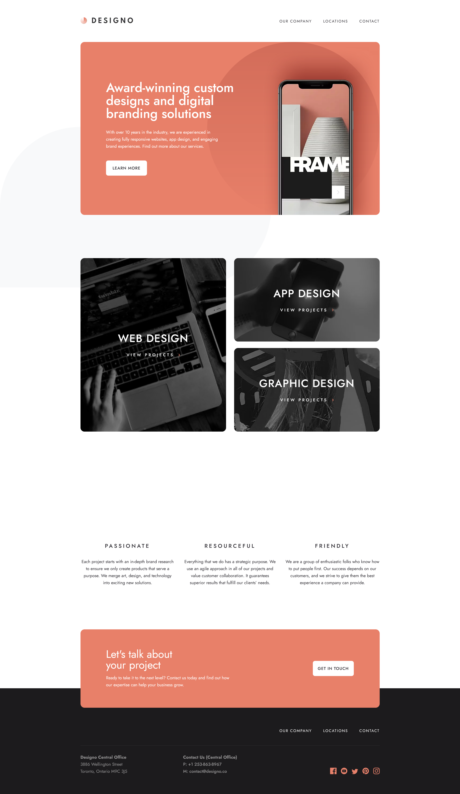

# Frontend Mentor - Designo agency website solution

This is a solution to the [Designo agency website challenge on Frontend Mentor](https://www.frontendmentor.io/challenges/designo-multipage-website-G48K6rfUT). Frontend Mentor challenges help you improve your coding skills by building realistic projects.

## Table of contents

- [Overview](#overview)
  - [The challenge](#the-challenge)
  - [Screenshot](#screenshot)
  - [Links](#links)
- [My process](#my-process)
  - [Built with](#built-with)
  - [What I learned](#what-i-learned)
  - [Useful resources](#useful-resources)
- [Author](#author)

## Overview

### The challenge

Users should be able to:

- View the optimal layout for each page depending on their device's screen size
- See hover states for all interactive elements throughout the site
- Receive an error message when the contact form is submitted if:
  - The `Name`, `Email Address` or `Your Message` fields are empty should show "Can't be empty"
  - The `Email Address` is not formatted correctly should show "Please use a valid email address"
- **Bonus**: View actual locations on the locations page maps (we recommend [Leaflet JS](https://leafletjs.com/) for this)

### Screenshot

### Links

- Solution URL: [Frontend Mentor Solution](https://www.frontendmentor.io/solutions/designo-website-using-next-13-app-router-and-typescript-DljppcoUgI)
- Live Site URL: [Live Site at Vercel](https://designo-one-lake.vercel.app/)

## My process

### Built with

- Semantic HTML5 markup
- CSS custom properties
- Flexbox
- CSS Grid
- Responsive Design
- Mobile-First Approach
- CSS Animations
- [React](https://reactjs.org/)
- [Next.js with App Router](https://nextjs.org/)
- [Leaflet JS](https://leafletjs.com/)

### What I learned

I've learned how to work with React Server Components and the new App Router.

In terms of web accessibility and user experience, I've learned how to create custom links that effectively highlight the current page by utilizing the 'aria-current='page'' attribute.

To enhance accessibility in client-side navigation, I've implemented a recommended practice: automatically focusing on the initial heading of a page during navigation via keyboard.

Furthermore, I've deepened my understanding of optimizing forms for users relying on assistive technologies. I now use attributes like 'aria-required' to mark mandatory fields, 'aria-invalid' to flag errors, 'aria-describedby' to provide additional information, and 'aria-live' regions to announce dynamic changes, making forms more user-friendly and inclusive.

### Useful resources

- [React Leaflet Tutorial](https://www.youtube.com/watch?v=jD6813wGdBA) - helped me a lot, when I was working with Leaflet.
- [Required attribute requirements](https://www.tpgi.com/required-attribute-requirements/)
- [What we learned from user testing of accessible client-side routing techniques with Fable Tech Labs](https://www.gatsbyjs.com/blog/2019-07-11-user-testing-accessible-client-routing/)

## Author

- Frontend Mentor - [@Akherousin](https://www.frontendmentor.io/profile/Akherousin)
